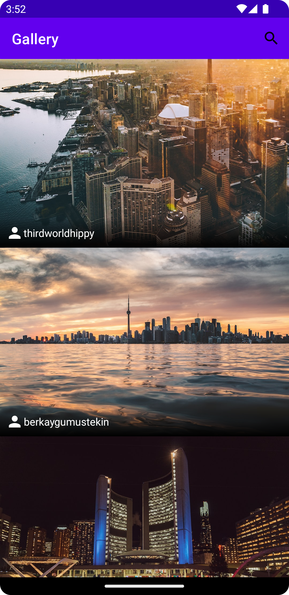

## UnsplashGallery

#### An online gallery to view images from Unsplash.com. Integrates [Unsplash Developer API](https://unsplash.com/developers) to download images and metadata. 

---

`Note:
For the app to work, register on the Unsplash Developer API website, get an access key and paste it into the gradle.properties file in the root folder. And you're done! 
`

---

### Libraries Used:
* Navigation
* Dagger Hilt (Dependency Injection)
* Retrofit + GSON (Networking) 
* Glide (Image Loading + Caching)
* Paging 3

---

### Screenshots:
| | | | |
|---|---|---|---|
|  |  |  | 
